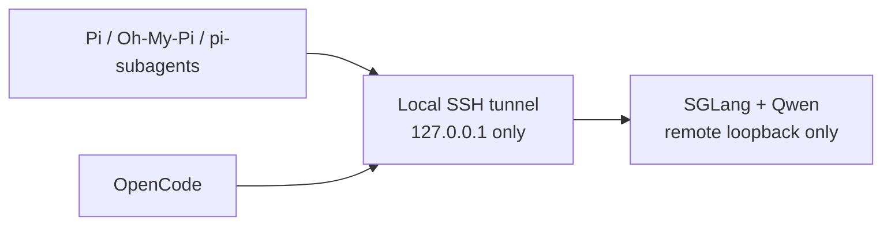

<p align="center">
  
</p>

# Sovereign Kit

Private Qwen routes for Pi and OpenCode.

Sovereign Kit is a small macOS setup for teams that want their coding agents to use one approved model endpoint instead of a public model API.

It installs isolated Pi and OpenCode profiles, then connects them to a Qwen/SGLang server through a loopback-only SSH tunnel. The shipped profiles do not include OpenAI, Anthropic, DeepSeek, OpenRouter, or other model providers.



This is a reference setup, not a compliance product. It does not make a rented GPU legally sovereign, prove GDPR compliance, supply a DPA, or sandbox every tool and plugin used by an agent.

## What is here

- an isolated Pi profile with `pi-subagents` and Oh-My-Pi;
- a locked OpenCode configuration;
- `sovkit-tunnel`, an SSH forward that binds locally to `127.0.0.1` and requires a verified host key;
- a macOS installer;
- the Qwen/SGLang launch settings used for the published benchmarks.

The reference path uses `RadixArk/Qwen3.8-27B-NVFP4`. That is the tested model, not a permanent requirement for the project.

## Before you install

You need a Qwen/SGLang host that you control or have explicitly approved. Its inference port must bind to loopback, not the public Internet.

Read the [quick start](docs/quickstart.md), [server setup](docs/server.md), and [security boundary](docs/security.md) before sending client material through the route.

## Install

```bash
git clone https://github.com/maximilienGilet/sovereign-kit.git
cd sovereign-kit
./install-macos.sh --with-opencode
```

The installer writes an isolated Pi profile and installs the wrappers in `~/.local/bin`. It will not overwrite an existing profile unless you pass `--upgrade`.

## Open the tunnel

Check the remote SSH host key out of band. Use a dedicated unprivileged SSH account, a dedicated identity, and a dedicated known-hosts file.

```bash
sovkit-tunnel <ssh-host> <ssh-port> <tunnel-user> \
  <identity-file> <known-hosts-file>
```

The command forwards `127.0.0.1:30000` on the Mac to `127.0.0.1:30000` on the GPU host. It does not expose the endpoint on your LAN.

## Start a client

```bash
pi-sovereign
# or
opencode-sovereign
```

Before any client work, run:

```bash
sovkit doctor
```

For Pi, run `/subagents-models` before client work. The parent and every worker should show:

```text
sovereign-qwen/qwen3.8-27b-nvfp4
```

If a different provider appears, stop and fix the local profile first.

## Read before production use

The reference server command uses `--trust-remote-code`. That executes model-provided Python on the GPU host. The model revision and server image digest are pinned, but both still require review before a client deployment.

A local tunnel limits network exposure. It does not answer questions about a provider's contract, region, retention, disks, logs, egress, or access controls. Those are deployment and client decisions.

The local port is available to processes running under the same macOS account. The shared Pi + OpenCode V1 route is keyless at the SGLang API layer and relies on SSH plus loopback bindings. Do not enable SGLang API authentication for this shared route until Pi secret injection has been implemented and tested.

## Benchmarks

These are synthetic capacity tests on one RTX PRO 6000 S (96 GB), not performance or cost promises:

- [one request near the 262K context limit](benchmarks/benchmark-262k-rtx-pro-6000-sglang.md): 246K input + 8,192 output completed at about 48.2 tok/s decode;
- [one 128K principal plus four 32K workers](benchmarks/benchmark-shared-128k-plus-4x32k.md): all five requests completed, but concurrent prefills pushed the principal TTFT to about 60 seconds.

[Architecture notes](docs/architecture.md) explain the routing and the resulting admission-control recommendation.

## Documentation

Start with the [documentation index](docs/README.md).

- [quick start](docs/quickstart.md)
- [local setup](docs/local-setup.md)
- [server setup](docs/server.md)
- [operations and troubleshooting](docs/operations.md)
- [security boundary](docs/security.md)
- [architecture](docs/architecture.md)
- [choosing an inference route](docs/choosing-an-inference-route.md)
- [benchmarks](benchmarks/README.md)

## License

[Apache License 2.0](LICENSE).
