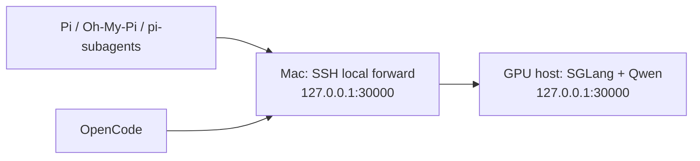

# Architecture

Pi and OpenCode do not contact the GPU host directly. They call `127.0.0.1:30000` on the Mac. `sovkit-tunnel` forwards that port over SSH to `127.0.0.1:30000` on the GPU host.

The server must bind to remote loopback. The tunnel must bind to local loopback. Neither endpoint should listen on a public address.

## Client controls

The Pi profile contains one provider, `sovereign-qwen`. `pi-subagents` has a strict allowlist of `sovereign-qwen/*`, so the parent and workers use the same model route.

The OpenCode wrapper injects its configuration through `OPENCODE_CONFIG_CONTENT`. That takes precedence over a repository `opencode.json`, so a checked-out project cannot turn on another provider through its own config.

These controls restrict model-provider selection. They do not sandbox plugins, shell commands, browser tools, Git remotes, or any other egress path used by an agent.

## Concurrency

One SGLang process serves concurrent requests. This is not five copies of the model running on one GPU.

The shared benchmark showed that one 128K principal and four 32K workers fit on an RTX PRO 6000 S, but sending all five large prompts together delayed the principal's first token by about 60 seconds. Submit the principal first, then send bounded worker tasks after it starts responding.

See the [benchmark index](../benchmarks/README.md) for exact hardware, workloads, and limits.
